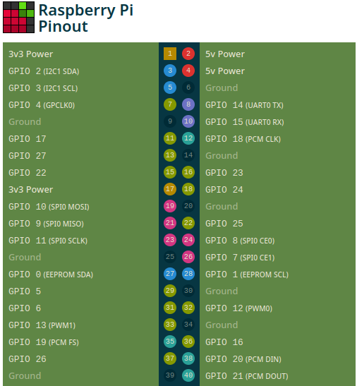
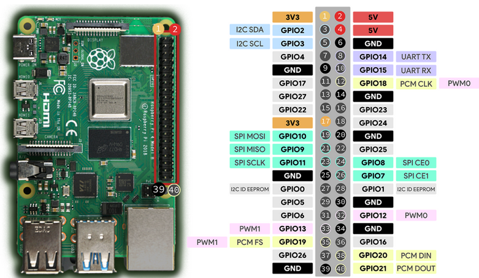

https://pinout.xyz/



Or like this:  


# Wiring to breadboard (just power rails)

To power the breadboard and connect it to common GND:

```text
Pin 1 (3.3 V) -> breadboard (+ rail)
Pin 6 (GND)  -> breadboard (- rail)
```

## Safety note

- NEVER connect: 5 V pin -> GPIO
- Only use: 3.3 V + GND


