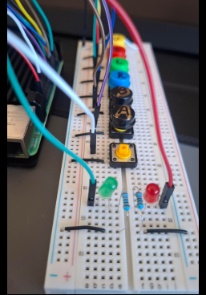
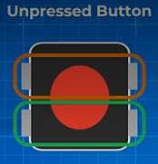
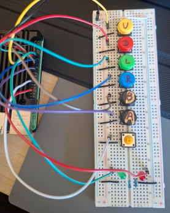
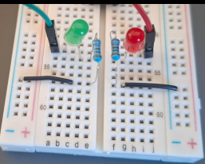
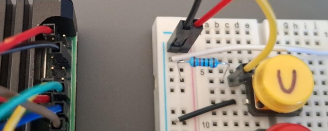

## Parts list

- Raspberry Pi (OS + Python 3)
- Solderless breadboard
- **7×** momentary pushbuttons for **up**, **down**, **left**, **right**, **A**, **B**, and **RESET**
- **2×** LEDs (e.g. one “success”, one “error”)
- **2×** current-limiting resistors (~220 Ω-330 Ω) for the LEDs  
- **Optional (external pull-ups only):** 7× ~10 kΩ resistors (one per button)
- Jumper wires 

## What the Konami code is

The sequence to detect is:

```text
UP, UP, DOWN, DOWN, LEFT, RIGHT, LEFT, RIGHT, B, A
```

Each step is one physical button press. **RESET** is not part of the Konami string; it only clears your progress in case the wrong buttons are pressed (see [Konami-Code-internal-pull-up-lgpio.py](Konami-Code-internal-pull-up-lgpio.py), or the [RPi.GPIO](Konami-internal-pull-up-rpigpio.py) variant).

## GPIO pin map (BCM → action)

The programs use **BCM numbers** for each line (RPi.GPIO / gpiozero call `GPIO.setmode(GPIO.BCM)`; **lgpio** uses the same numbers when claiming pins). Match BCM names to **physical** header pins with [pinout.xyz](https://pinout.xyz/) or [02-GPIO-Pin-Locations](02-GPIO-Pin-Locations.md).

| Action | GPIO (BCM) | Physical pin (40-pin header) |
|--------|------------|--------------------------------|
| UP | 17 | 11 |
| DOWN | 27 | 13 |
| LEFT | 22 | 15 |
| RIGHT | 23 | 16 |
| B | 24 | 18 |
| A | 25 | 22 |
| RESET | 5 | 29 |
| Green LED (feedback) | 18 | 12 |
| Red LED (feedback) | 16 | 36 |

## Breadboard layout (how this note names holes)

This build uses the board **vertically**: letters **a-j** run along the **top** (columns), and **1, 2, 3, …** are **rows** down the sides. The **red (+)** and **blue (−)** power rails are on the **left and right** long edges. The **slot (ravine)** in the middle separates column **e** from column **f**.

- Holes **(row, a)** through **(row, e)** in the same row are **one electrical node** (five holes tied together).
- Holes **(row, f)** through **(row, j)** in the same row are **one node** on the other side of the ravine.
- **(row, e)** is **not** connected to **(row, f)** unless you bridge them - a button straddling the ravine does that when pressed.

Buttons are placed **down the middle**, with legs on both sides of the **e | f** gap. LEDs and resistors sit on the **left block (a-e)** and the **right block (f-j)**; I complete each circuit with jumpers as below.



## 4-pin tactile switches

Each button has **four** legs. Two pairs are already connected **inside** the package (each pair is two legs on opposite sides of the ravine, e.g. **Nd** and **Ng** on one row); **not** pressed, those two pairs are isolated from each other; pressed, the two pairs connect (normally open between pairs). Wire so **GPIO** and **GND** (or **3.3 V**, for a pull-down layout) go to **different** pairs.



## Power the Pi and tie the breadboard to the Pi

Set up the Pi (USB-C power, monitor, keyboard, mouse) as in [01-Prep-Raspberry-Pi](01-Prep-Raspberry-Pi.md).

**Always:**

1. Connect the Pi **GND** (e.g. physical pin **6**, or any GND pin) to the breadboard **blue (−) rail** 
2. **Never** connect **5 V** from the Pi to any **GPIO** pin.

**3.3 V to the red (+) rail:**

- **Internal pull-ups ([Wiring option 1](#wiring-option-1--internal-pull-ups)):** you **do not** need 3.3 V on the breadboard for the buttons. The Pi’s internal resistors pull inputs toward 3.3 V inside the chip; your switches only connect inputs to **GND** when pressed.
- **External pull-up resistors:** you **do** need a stable **3.3 V** on the breadboard: run a wire from **physical pin 1 (3.3 V)** to the **red (+) rail** (same rail-bridging idea as GND if your board splits the + rail).

## Wiring option 1 - Internal pull-ups

This path matches the internal-pull-up scripts — primarily [Konami-Code-internal-pull-up-lgpio.py](Konami-Code-internal-pull-up-lgpio.py); same wiring for [Konami-Code-internal-pull-up-gpiozero.py](Konami-Code-internal-pull-up-gpiozero.py) and [Konami-internal-pull-up-rpigpio.py](Konami-internal-pull-up-rpigpio.py).
### Idea

Each input GPIO is configured with an **internal pull-up**: 
- **not pressed** → pin reads **HIGH**; 
- **pressed** → switch ties the pin to **GND** → reads **LOW** (active-low). 
- No extra resistors for the buttons.

### Code (RPi.GPIO example — same BCM map in the **lgpio** and **gpiozero** scripts)

Pin map and setup:

```python
GPIO.setmode(GPIO.BCM)

pins = {
    "UP": 17,
    "DOWN": 27,
    "LEFT": 22,
    "RIGHT": 23,
    "B": 24,
    "A": 25,
    "RESET": 5,
}

GREEN_LED = 18
RED_LED = 16

for pin in pins.values():
    GPIO.setup(pin, GPIO.IN, pull_up_down=GPIO.PUD_UP)

for led in (GREEN_LED, RED_LED):
    GPIO.setup(led, GPIO.OUT)
    GPIO.output(led, GPIO.LOW)
```

Reading a press (idle = HIGH, pressed = LOW):

```python
def read_pressed_button():
    for name, pin in pins.items():
        if GPIO.input(pin) == GPIO.LOW:
            return name
    return None
```

### Breadboard: buttons

Mount each switch so each pair uses **one row** and legs **d** and **g** (ravine between **e** and **f**), e.g. **6d/6g** and **8d/8g** for one button ([4-pin tactile switches](#4-pin-tactile-switches-large-footprint)).

For **each** button (internal pull-up, active-low):

1. Pick which **row** is the GPIO side and which is the GND side (in the example, **row 6** = GPIO, **row 8** = GND).
2. Run **one** jumper from the Pi **GPIO** to **any hole on the left block** in the GPIO row 
3. Run **one** jumper from **any hole on the left block** in the GND row to the **blue − GND rail** 

Unpressed, the internal pull-up holds the pin HIGH; pressed, the GPIO row is tied to the GND row through the switch → reads **LOW**.



### Breadboard: LEDs (same for both wiring options)

Use **two** separate chains (do **not** share one resistor between two GPIOs).

For each LED: **GPIO pin → LED anode (long leg) → LED cathode (short leg) → resistor (~220 Ω-330 Ω) → blue − rail (GND)**.

**Example - green LED (BCM 18, physical pin 12 on Pi)** as wired on this board:



## Wiring option 2 - External pull-ups or pull-downs

### Wiring

For the same **active-low** behavior as Option 1 (rest = HIGH, pressed = LOW), use **external pull-ups** wired like the internal-pull-up case: Connect **3.3 V** from the Pi (**pin 1**) to the breadboard **red (+) rail** (see [Power](#power-the-pi-and-tie-the-breadboard-to-the-pi) above). Resistor from **3.3 V** to the GPIO node, button from that node to **GND**. That matches the rest of this project and keeps “pressed = LOW” in software. When the button is open, the 10 kΩ pulls the line to 3.3 V (HIGH). When pressed, the switch shorts the line to GND (LOW).



**External pull-down** (rest = LOW, pressed = HIGH) also works, but you would invert the read logic (`GPIO.HIGH` means pressed). There is no electrical need for pull-downs here unless you prefer that convention.

### External pull-up 

Wiring see above

**Software:** use plain inputs **without** internal pull-up, so you are not doubling up on pull-ups (if your RPi.GPIO version supports it, `pull_up_down=GPIO.PUD_OFF`; otherwise omit extra pull settings per your library docs).

```python
for pin in pins.values():
    GPIO.setup(pin, GPIO.IN, pull_up_down=GPIO.PUD_OFF)  # external 10k to 3.3V + button to GND
```

`read_pressed_button()` stays the same: **LOW** = pressed. Full script: [Konami-external-pull-up-rpigpio.py](Konami-external-pull-up-rpigpio.py) (same logic as [Konami-internal-pull-up-rpigpio.py](Konami-internal-pull-up-rpigpio.py), different `GPIO.setup` for inputs).
### LEDs

Same as [Option 1 - LEDs](#breadboard-leds-same-for-both-wiring-options).

## Run the program

- Install (RPi.GPIO version): `sudo apt install python3-rpi.gpio` (package name may vary by OS image).
- Internal pull-ups on the Pi (RPi.GPIO): `python3 Konami-internal-pull-up-rpigpio.py`
- Internal pull-ups on the Pi (lgpio): `python3 Konami-Code-internal-pull-up-lgpio.py`
- Internal pull-ups on the Pi (gpiozero): `python3 Konami-Code-internal-pull-up-gpiozero.py`
- External pull-ups on the breadboard: `python3 Konami-external-pull-up-rpigpio.py`

Use `sudo` only if your user is not in the `gpio` group and access fails.

If wiring matches the tables, each correct Konami step blinks **green**, a wrong step blinks **red**, and **RESET** clears the sequence with a short **double green** flash.

More detail on the script: 
- start with [04a-Explain-Py-Code-lgpio](04a-Explain-Py-Code-lgpio.md) (main); [04b-Explain-Py-Code-gpiozero](04b-Explain-Py-Code-gpiozero.md) and [04c-Explain-Py-Code-rpigpio](04c-Explain-Py-Code-rpigpio.md) cover the same logic with other libraries. 
- more theory on pull resistors: [04-pull-up-pull-down-resistor](../../04-transistors/04-pull-up-pull-down-resistor.md).
