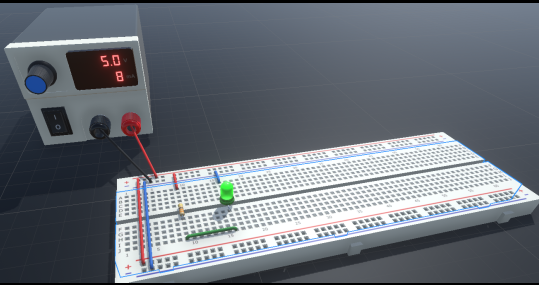
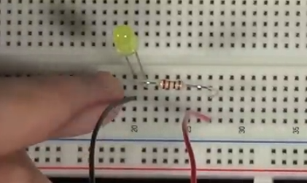
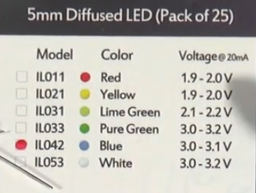
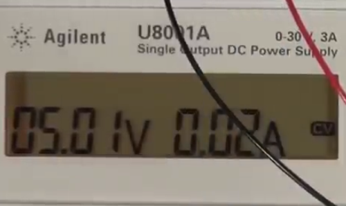

# How to build a simple LED circuit
An LED is a diode, which means it allows current to only travel in one direction: 
- The **shorter** lead is the `cathode`: I hook this up to the **negative** side of my voltage source.
- The **longer** lead is the `anode`: I hook this up to the **positive** side of my voltage source.
- I put the LED on the breadboard to either spread from one column to another one (so it's not on the same line) or across the middle section (same reason).
- I connect the resistor so that power goes into resistor first, then to LED, then to GND.
- I connect positive power rails.
- I connect negative/ground power rails.
- I connect power source to power rails.

I can also hook it up just like this for demonstration purposes:  

Different coloured LEDs need different voltage for them to light up and the following specs show the max voltage the various LED colours can handle:  

# Why I need resistors to limit voltage
If I give the LED the appropriate voltage with my power supply, the LED should just draw the appropriate current it needs (amperage) even if the power supply could supply a much higher current. 
If I can control the voltage to just stay within what the LED can handle, it's all fine, but if the voltage is higher than that:
- the amperage goes high fast with just a tiny voltage increase
- LED burns out, cause `power = I x V `and this creates heat see [power-formula](power-formula.md)
- and then amperage drops after LED burnt out
> In a real circuit we don't have perfect control and we need a resistor to limit the current.

## Kirchhoff's voltage law in action
Resistor -> limit the voltage  
Sometimes a datasheets provides specs about what your component can handle. In the case of the LED, the specs said at 2 V we draw 20 mA, but with more V, the current increases a lot, the LED draws too much power, and burns itself out.

Why?   
> **Kirchhoff's law: voltage or voltage drop across every component in the circuit has to equal zero**

That means, the battery has a voltage drop of 5 V (providing that voltage), and if the LED is the only other component in the circuit, it has to consume 5 V (which is too much).  
If I add a resistor and I want the LED to consume 1.9 V (to be safe) then the resistor will consume 3.1 V. **The circuit settles at a current where the LED drop (~1.9V) is satisfied**. The resistor drops the rest. 
## How to figure out which resistor to use - Ohm's law in action
What resistor to chose in my designs?
> Ohm's law: `V = I x R` see [Ohms-law](Ohms-law.md)

- I know the voltage for the resistor should be 3.1 V, we know the current (from manufacturer), is 0.02 A
- 3.1 V = 0.02 A X R
- resolve for R, that's 3.1 V / 0.02 = 155 Ohm  
--> so my resistor needs to be 155 Ohm

I only have a 150 Ohm or 220 Ohm resistor, so for my circuit I'll use the 220 Ohm resistor to be on the safe side.

And at 5 V, we only draw 0.02 A as desired.  

