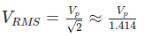

source: TCM IoT course

# Core Concepts
- best to think of `current` as fixed or fluctuating voltage
- **Current (I):** The flow of electrons. It is proportional to **Voltage (V)** and inversely proportional to **Resistance (R)**.
- **Ohm’s Law:** `I=V/R`.
- **Power (P):** Calculated as `P=V×I` or `P=I2×R`.
# DC = direct current = fixed voltage
- **Characteristics**: fixed, unidirectional, steady voltage
- **Usage:** Internal computer circuits, microcontrollers (ESP32, Arduino), smartphones, and batteries.
	- most internal circuits and components, such as microcontrollers, processors, and sensors operate on low-voltage DC
	- **Semiconductors**, such as those in microchips, transistors, and diodes, require **steady DC** voltages to function correctly. They are designed to work with a constant, unidirectional flow of current, which is **DC**.
	- Devices often need various **voltages** (e.g., 5V, 12V, 3.3V) to power different parts of the device. These **voltages are typically supplied in DC** from internal circuits, regardless of the AC input.
	- **Batteries** (like in laptops, smartphones, and IoT sensors) inherently supply **DC voltage** (e.g., 3.7V, 5V, etc.), which is what most portable electronics use.
- **Why DC for Electronics?** 
	* **Semiconductors** (transistors/diodes) require a constant, stable pressure (voltage) to switch on/off reliably.
	* **Logic Levels:** Digital "0" and "1" rely on steady voltage thresholds (e.g., 0V and 3.3V)
>  Ohms Law = current proportional to that voltage, and hence current is also going to be a fixed level
>  the value of that current is going to be proportional to the resistance of eg a light bulb
# AC = alternating current=fluctuating voltage
- AC comes out of power outlet
	- AC used more by high power applications like lights, heating, large appliances
	- washing machines, industrial machines (HVAC systems, fans, power tools)
	- electric grids to transport electricity over large distances
- **Characteristics:** Voltage and current periodically reverse direction (sinusoidal).
- **Standardization:**
    - **North America:** 120V RMS @ 60Hz.
    - **Europe/Australia:** 230V RMS @ 50Hz. (current alternates 50 times per second)
- like a sin wave, voltage and current `I` proportional to resistance
> voltage keeps flipping (from positive to negative and flips from negative to positive) -> direction of current changes

- This difference in frequency can affect certain devices, like clocks or motors that are frequency-dependent.
- appliances designed for one region might not work in the other without a **voltage converter**.

## Why difference between regions?
- the difference large historic
- higher voltage allows for more efficient transmission over long distances
- *with higher voltage you can transmit power at lower currents (less loss due to resistance)*
	- better for large scale power distribution
	- better economics: Standardizing on a higher voltage (230V) allowed for the design of smaller power distribution equipment and appliances, which helped reduce manufacturing and installation costs.
## Danger: 
- depends on current and depends on both voltage and resistance  
	- `I = V/R`
- voltage determines how much current can flow
- current is what damages your body in an electric shock; some indicators:
	- **1 mA (milliampere)**: Barely perceptible
	- **5 mA**: Painful, but not harmful
	- **10-20 mA**: Muscle contractions, difficulty letting go of the source
	- **100 mA**: Can be fatal (causes heart to stop beating)
	- **500 mA and above**: Severe tissue damage or immediate cardiac arrest.
## Measuring AC: The RMS Value
RMS = Root Mean Square
- For **DC voltage**, the voltage is constant, so we simply use the **direct value** (e.g., 5V DC means a steady 5V).
- For **AC voltage**, the voltage fluctuates in a sinusoidal waveform (in most cases), so we need a way to represent the **effective value**—the **equivalent DC value** that would produce the same power as the AC voltage. That's where **RMS** comes in.
- A **120V RMS AC** supply delivers the same power to a resistor as a **120V DC** supply.
- In other words, **RMS voltage** makes it possible to equate AC to DC in terms of their power-delivering ability, e*ven though the forms of the voltages are quite different.*
- Power Dissipation:
	- The power dissipated in a resistor by both AC and DC is *proportional to the square of the voltage*, so we can use the RMS value to calculate the power dissipated in a resistor with AC, just as we would with DC:  
	- This is why RMS is important: it helps us understand the **power** delivered by AC circuits in the same way we understand DC circuits.
	- When you see **120V AC** on your household outlet (USA), that's the **RMS** value.
	- The **peak voltage** of the signal would be higher, around **170V**.
	- But the **RMS value** (120V) is what determines the actual **power delivered** to devices like lamps, toasters, etc.

- `RMS Voltage = root mean square`
	- RMS = Vp/sqrt (2)   = peak voltage divided by the square root of 2 (approximated to 1.41)
	- RMS = 170 / 1.41  = 120 VAC
	- that's the north American household voltage
	- *RMS is a good way to compare between DC and AC and whether the AC signal would produce the same power (or heat) in a resistor as a DC voltage of the same value*

- **Peak Voltage (Vp​):** The maximum instantaneous voltage (e.g., ~170V for a US outlet).
- **RMS (Root Mean Square):** The "effective" voltage.
    - **Definition:** The AC voltage that performs the same amount of **work** (heat/power) as a DC voltage of the same value.
    - **Formula:**   
	  
    - Example: `170V Peak / 1.414 = 120V RMS`.

# How AC is Converted to DC:
**AC voltage** from the power outlet needs to be converted to **DC** through a few key stages:
- **Rectification**: A circuit called a **rectifier** converts the AC into pulsating DC.
- **Filtering**: A **capacitor** smooths the pulsating DC signal.
- **Regulation**: A **voltage regulator** ensures a steady, constant DC voltage (e.g., 5V, 12V) suitable for the internal circuits.
**Power Supply Unit (PSU)**: Converts **AC** from the outlet into the required **DC** voltages for the motherboard and components.
**Battery-Powered Devices** (like laptops): The **battery** provides **DC** power directly to the device.
mobile charger: **Charging**: The charger converts **AC** to **DC** to charge the battery.