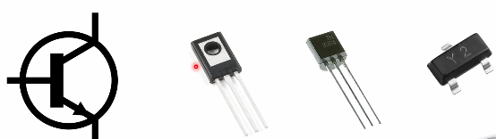
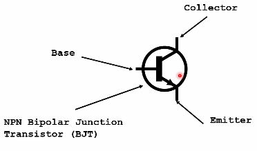
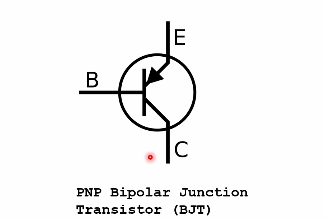
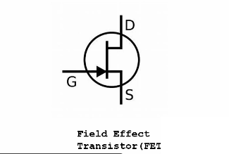
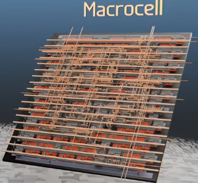
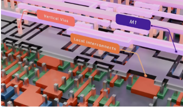
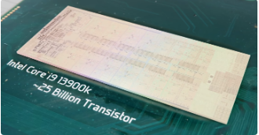
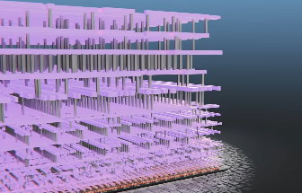

Sources: 
CoreDumped https://www.youtube.com/watch?v=HjneAhCy2N4&t=2s (free)
Branch Education: https://www.youtube.com/watch?v=_Pqfjer8-O4&t=602s (free)
Book: Introduction to Computer Organization  (R.G. Plantz)
# what are transistors

- transistor is a device whose resistance can be controlled electronically, hence *active component*
- transistors are inside of processors/integrated circuits (millions and billions)
- Moore's law: every year the max amount of transistors we can fit on ICs (single wafer of silicone, the material ICs are made of) will double
- transistors act as switches: electrically represent on/off
- logical 0 may be represented by 0 Volts
- logical 1 could be represented by 5 V (example)
- if we apply current to its `base` terminal it lets electricity flow through, it acts as `conductor`
- base can act as an `insulator` in a circuit preventing electricity from flowing between `collector` and `emitter` terminals
- it allows computer to do maths and interpret instructions
## NPN Bipolar Junction Transistor (BJT)
- 3 leads/inputs

## PNP Bipolar Junction Transistor (BJT)

## Field Effect Transistor (FET) - MOSFET
- Drain, Gate, Source

## Standard cell
- a few `transistors` together
- fundamental building block of a CPU or GPU
	- eg `2` transistors connected together, form an `inverter` standard cell see [how inverters work](../06-logic-gates/03-NOT-gate-inverter.md)
	- `4` transistors connected together form a `NAND` Gate see [how NAND works](../06-logic-gates/04-NAND-gate-4-transistors.md)
	- `6` transistors form an `OR` gate see [how OR gates work](../06-logic-gates/06-OR-gate-6-transistors.md)
## Macrocell (or Modules, Functional Blocks/Units)
- a few standard cells put together, 
- wide range of macrocells (some with multiple thousand standard cells)
- 160 standard cells to create eg an `Adder` Macrocell that can add two numbers together see [adder](../06-logic-gates/11-full-adder.md)

- to connect all those standard cells together it needs:
	- a higher layer of vertical `vias` and wires, called `Metal 1` or `M1`  

- multiplication is more complex, so for 32-bit multiplication we have a `macrocell` built from `6100` standard cells 
## IP Core
- multiple `macrocells` build an `IP core`
## Core or hardware accelerator
- multiple `IP Cores `are combined into a `core` or `hardware accelerator`
## complete chip/processor
- and those cores can be combined into a complete chip, eg a processor
- which can be found inside the CPU mounted onto a motherboard
- processors have 10s of billions of transistors  

- they use about *17 metal layers of wires* connected together
	- to form the `Macrocells`, `IP cores`, `cores` and other sections of the CPU

