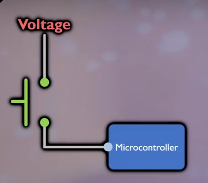
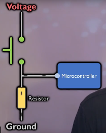
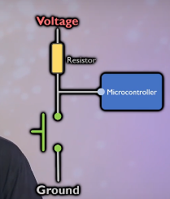

# pull-up and pull-down resistors
- Pull-up and pull-down resistors **set a default (idle) voltage** on a signal line when **nothing else is driving it**.
- They prevent the input from becoming **floating (undefined voltage)**.
- They are **not special components**—just regular resistors used in a specific way (placement + connection).
## Why have it?
- to avoid a `floating` state: Without a pull-up or pull-down resistor, an open switch creates a `high-impedance` connection where the pin is not connected to a defined voltage... microcontrollers like Arduino have no idea how to interpret this
- **To prevent unpredictable behavior:** A floating pin is susceptible to electrical noise, leading to random and unreliable readings (like a flickering LED).
- To prevent **short circuits**: When a switch is used to connect a pin to ground or `Vcc` the resistor limits the current flow. Without the resistor, closing the switch could create a direct short circuit, potentially damaging the components
### Example simple circuit with button
ok, and that all means.... what?: 

- when button is pressed, voltage travels through the switch to the input pin of the microcontroller
	- the microcontroller reads off the pin, sees the voltage and reports a `high`
- but if botton is not pressed, the pin on the microcontroller is connected to nothing ... doesn't know what that is
	- --> `floating`; and the only voltage would be from interference or environmental stuff, so basically turns it into an *`antenna`*
		- and if you were to measure it, the voltage reading would *`fluctuate`*
		- same happens in transistor-based circuits as transistors act like switches
	- hence we need to *pull it down to GND* or *pull it up* to VCC using a resistor
### Pull-down resistor: 
close switch -> `high`, open switch -> `low` thanks to `pull down resistor`
but that's just a convention; could be the other way around: register `low` when circuit is closed (`normally closed switches`), otherwise for `normally open switches` use [Pull-up resistor](#pull-up-resistor)
- When button is not pressed, the resistor connects the signal line to **GND** (`0V`); it's not floating anymore
- Ensures that the line “`idles low`” when nothing is pulling it high.
- Common example: `Enable` pins, `chip select` lines, sometimes logic inputs.
- When button/switch is pressed, the voltage flows through to microprocessor pins/ signal line is connected to Vcc, registering a `high` reading
- If we don't use a resistor and connect directly to `GND`, we get a short circuit when the button/switch is pressed
	- meaning the **voltage source comes in direct contact with `GND`**
	> Ohm's law: without resistance, a large amount of current will flow, creating a ton of heat throughout the microcontroller and any components in the way -> burn out
	- that's why `pull resistors` are of fairly high resistance as sending a signal to a microcontroller doesn't need a ton of current (we typically only want current at `microampere` scale to detect a signal)
	- particularly when circuit is closed a lot, cause then we have more time that connection from voltage source to GND exists and current moves through that resistor
	

### Pull-up resistor:
- Reverse to pull-down: --> *Connects the signal line to **Vcc (positive rail)** through a resistor.*
- Ensures that the line “`idles high`” when nothing is pulling it low.
- Common example: **I²C, UART TX lines, Reset pins, GPIO inputs**.
- A pull-up resistor connects a pin to the positive voltage supply `Vcc`, pulling it high when no other signal is present.

