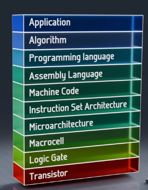

## Where are transistors & logic gates used in computing

### processing bits - the computing fabric - CPU
- transistors wired as logic gates that process bits
- do maths / decisions
- CPU and its ALU
### memory - storing bits
#### SRAM (CPU caches) - made of transistors & latches
- each bit is typically a tiny latch made of transistors (often a 6T cell: two cross-coupled inverters). In that sense, “memory made of transistors / latch circuits.” See [10-SRAM](../10-volatile-memory-DRAM-SRAM/10-SRAM.md).
#### working memory - DRAM
- each bit is usually 1 transistor + 1 capacitor, not a whole gate. 
- the transistor is an access switch; the capacitor holds the charge.
- that's why it is volatile and needs refresh. See [009-DRAM](../10-volatile-memory-DRAM-SRAM/009-DRAM.md).
#### disk - HDD - hard disk drives 
- storage is magnetic spinning platters.
- storage is **not transistor logic** gate cells.
- but the drive still has a controller board with chips/transistors ;)
- persistent storage, survives reboots.
#### disk - SSDs - flash memory chips / solid state drives
- still semiconductor, but each bit is stored as charge on a floating gate / charge-trap cell, not as a CMOS logic gate like NAND/OR/XOR.
- SSDs also have a controller full of digital logic.
- persistent storage, survives reboots.  
Note: “NAND flash” is an array organization name; it is not the same thing as a NAND logic gate.
#### How that charge-trap cell works:
- Imagine a tiny cage for electrons:
    - There is a special electrode called a `floating gate` (or a `charge-trap layer`).
    - To write a 1 or 0, the SSD forces electrons into / out of that cage using higher voltages.
    - Once trapped there, the electrons mostly stay, even after power-off.
    - Reading the cell means checking whether that trapped charge is present (it changes how the transistor behaves).  
So:
- CMOS logic gate (NAND/OR/XOR): transistors wired to compute a result from inputs right now.
- Flash cell: a special transistor structure used to park charge and remember a bit for a long time.
- Same broad silicon family, different job.