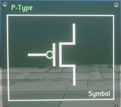

# transistor - P type FinFet
- opposite to N-type
- when `1` is applied, no electricity flows through the channel
- when `0` is applied, electricity flows

  
- the circle on the gate indicates the inverted functionality

  
