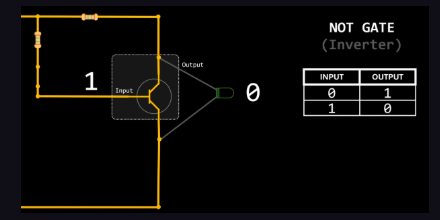
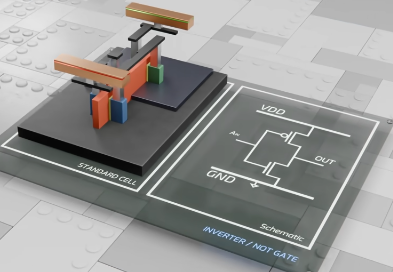
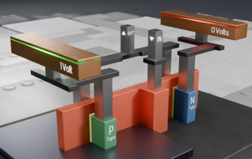
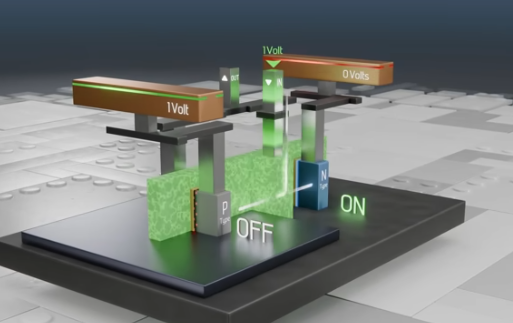
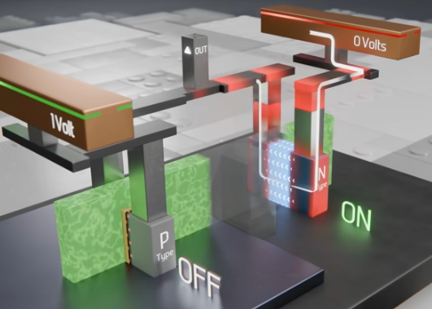
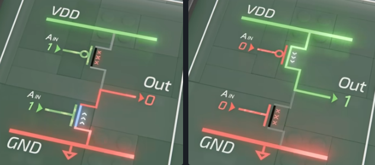

## NOT Gate or Inverter
- takes an input of `1` and outputs `0`
- and vice versa
- 2 transistors built on top of a silicon base
symbol:

      
simplified:

details:

# how the inverter works - standard cell
- put both `N-type` and `P-type` together
- we *connect* the `gate` between the two of them
- and *merge* the `input` gate contacts into a single contact
- there are also the `power` and `ground` `rails` above the transistors
	- the power rail is at `1 Volt` and always stays that way
	- the ground rail is at `0 Volt` and always stays that way
- now we add some wires, using the contact pads and vertical `vias`
	- that connect both sides of the transistor and the power rails to a layer of wires called `local interconnects`
- the power rails, vias and interconnects are simply wires made from conductive material like `copper`, `tungsten` or `aluminium`
- the input is the electrical wire that connects to the shared gate
- and the output which connects to the local interconnect wire connected to each of the two transistors
- all the empty spaces are filled with insulating material called dielectric

- now a single input voltage on the gate (either `1` or `0`) travels to the shared gate and controls both transistors
- because the `N-type` and `P-type` are opposite of each other
	- when `0` V is applied, the P-type will allow electricity to flow through the channel and is considered `ON`, and the `1V` rail is connected through the local interconnect wires and vias through the P-Types channel to the output
	- whereas the `N-type` will be `OFF`
	- and vice versa, when `1` V is applied the P-type is OFF, and N-type is ON, allowing `0` V from the Ground Rail to travel to the output

  

> so, when `1` Volt is applied to the input, the output is connected to the ground rail
> when `0` Volt is applied to the input, the output is connected to the power rail

  

