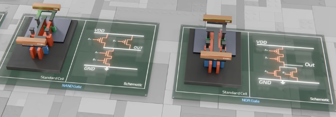
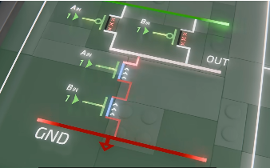
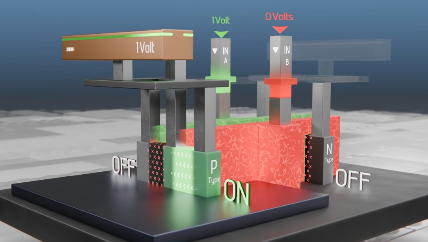
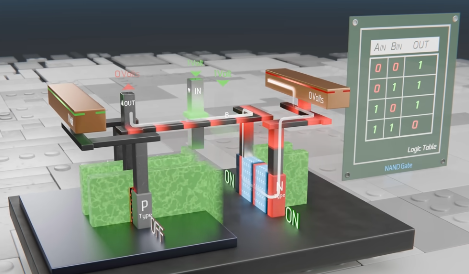

# NAND and NOR - 4 transistors

### NAND - AND followed by NOT
- 2x P-Type transistors in parallel above
- 2x N-Type transistors in series below
- the 2 inputs for the NAND gate are connected to one of each of the transistor gates 
- the output is in the middle of the cannel

*For Output to be `0`*:
- both inputs need to be `1`
	- this turns both N-types `on` and creating path from ground rail to the output

*For Output to be `1`*:
- either or both of the P Type transistors need to be `0`
	- makes path from Power rail to output
	- and blocks N-Types
*Standard Cell looks like this*
- gate in orange (merged)
- P-Type above, N-type below
- 2 inputs A and B
- and power rail and ground rail

- to build P-Type in parallel
	- we connect power rail to one side of each of the transistors
	- and the output is connected to the middle

- as per above, if either of inputs are `0`, 
	- either or both of the P-Types are `on`
	- then the 1 Volt rail is connected through the P-Types to the output

N-Type: in series
- onse side is connected to Ground and the other to the output

