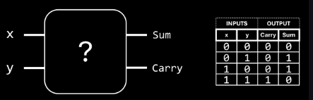
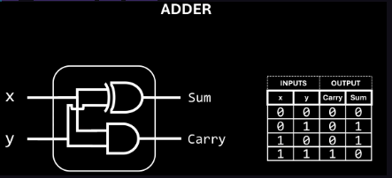
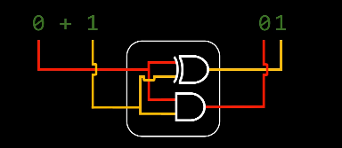
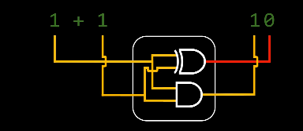
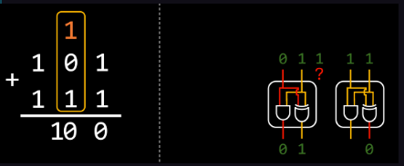

# half-adder: single-digit-addition: carry, sum
binary addition
- just like decimal: 
	- `0+0=0`, `0+1 = 1`, `1 + 0 = 1`, and `1 + 1 = 2`
	- but `2` cannot be expressed in binary
	- so we have a "left over", the `carry`, it has "overflowed" and we need an additional bit to represent the value: `1 + 1 = 10` in binary
	- so we need a circuit that takes 2 input values and 2 outputs, namely `Sum` and `carry

for the `Sum` we need a circuit that can output `0` when the inputs are the same and `1` when they differ
	- that's a `XOR` gate
- for `carry` circuit we need to output `0` unless both inputs are `1`, then we need output `1`
	- that's an `AND` gate

## limitation of half adder: multi-digit addition
 for example `101` plus `111`
- we add numbers in each column
- but the previous column might have created a carry, so just having an `ADDER` for each column doesn't work, cause the adder circuit only accepts 2 inputs
	- is built with an `AND` gate and an `XOR` gate
		- `XOR` = either one switch or the other has to be on exclusively for the output to be on as well
- --> this limitation is known as `Half ADDER`, not useful in this scenario

