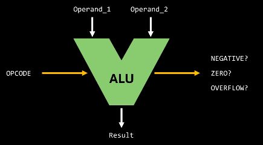
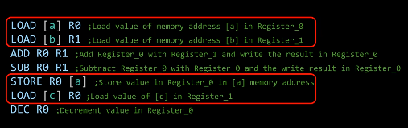
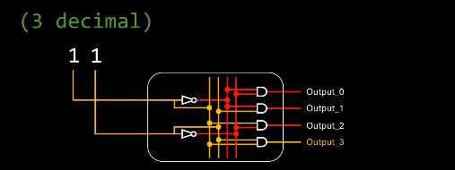
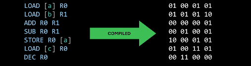
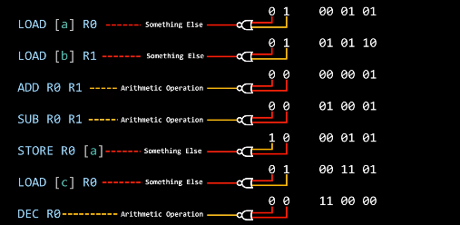
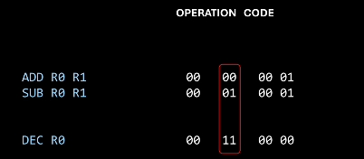

# ALU
- takes input values (`operand1` and `operand2`) and an `OP code` that tells the internal circuitry what arithmetic operation to perform between those values
- it then produces the result
- and additional information (`Status`); is the result `negative`, `zero` or `overflow`
- inside the ALU is the binary decoder that identifies the desired operation

# From instruction to circuit
Inside CPU is a special component that houses all these circuits
- when CPU reads an instruction, *how does it identify which one of these circuits corresponds to that specific instruction?*
- how does it know when it reads `ADD R0 R1`, that that's for the `Full Adder`
- some instructions aren't even arithmetic instructions, like `STORE` and `LOAD`

## binary decoders
*each combination triggers a specific output to be active, while all other outputs are deactivated*
- with our inputs we can control what outputs are turned on , by using gates that make sure only one output will be created
- with 4 inputs, we can control 16 outputs, **n inputs, 2^n outputs**
- *that's how we can create circuits that can select from multiple options*
- is that how instruction code works and can be read??? yes!
- that's how the binary decoder works
	- with an input, there will only be one output with value 1

- assembly code is just a human-friendly representation of machine code

- so we could assume that of `8 bit instruction code`, 
	- the *first 2 decide whether it's arithmetic or non-arithmetic*, 
		- we could do this with NOR gates
		

- and *if arithmetic*, the *next two what sort of arithmetic (like add, subtract etc)*; 
- this particular one is called `OPCODE`, which is associated with *exactly one kind of arithmetic operation*

- when the CPU has determined that the current instruction is arithmetic, the ALU receives this `opcode`