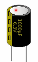
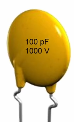
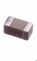

source: TCM IoT course
# Short
- Capacitors: hate change in voltage, block DC, loves High Frequency
- in DC circuits: like mini batteries, store energy in their electric field
	- for short dips in voltage or short power cuts, or to smooth out rapid changes in voltage
	- `Capacitance` `C`, measured in `Farads` = is the ability/property of the capacitor to hold onto this charge
	- we usually count in `micro Farads` (as Farads are a large unit of measurement) or even `nano` or `picofarads`
	- when capacitor is in steady state, there is no current flowing
- for alternating current:
	- transfer its charges over 'the gap', but not by passing electrons THROUGH the gap, but the capacitor will charge up, then discharge and the imbalance will allow us to transfer the current over to the other side
- can be used like filters
	- can block certain frequencies from going through circuit (comms signals, square wave with different frequencies, or interference)
- `reactance` = the higher frequency (and greater the size of capacitor), the *less it's going to resist the flow of current*
	- inversely proportional to the frequency and size of capacitor
- `impediance Z` = 
	- capacitor at high frequency offers very little resistance
	- capacitor at very low frequency offers a lot more resistance -> **filtering**, **decoupling**, **timing**, and **stabilizing** signals
		- **Power Supply Filtering / Decoupling:**
			- Capacitors smooth out voltage from the power supply, filtering out **high-frequency noise**.
			- Prevents noise from the power rail interfering with sensitive digital or RF components.
		- **RF Filtering & Tuning (think WiFI)**
			- In RF circuits (the part that actually generates or receives Wi-Fi signals), capacitors are part of filter networks (LC circuits) that select or reject certain frequencies.
			- These are tuned circuits — they define the center frequency and bandwidth.
			- --> filtering
		- **Signal Coupling / Blocking DC**
			- Capacitors can be used to pass AC signals (like RF) while blocking DC, which is useful in signal paths.
		- **Timing / Oscillators**
			- In some parts of the system, capacitors are used alongside resistors or crystals to set timing (like in clock circuits).

## types of capacitors
- they all have a max voltage rating that they can handle and it's written on them
### electrolytic capacitor
- they care about polarity (short wire is negative and long wire is positive)
- they **must be connected the right way around** — positive to positive, negative to ground.
- bulk power supply filtering (smooth out ripple from rectified AC)
- energy storage to circuits during sudden demands (prevent voltage drop when load spikes)
- common in audio amplifier input stages (coupling)
- timing circuit: used to control timing durations
- Electrolytics can **age**, drying out over 5–20 years depending on quality, use, and temperature.
- Heat accelerates degradation. Use high-temp rated caps (105°C or more) for better lifespan.

### disk ceramic capacitor
- great for fairly low capacitance
- very cheap to make
- don't care about polarity
- Filter or suppress **high-frequency signals**
- Withstand **high voltage spikes**
- Work in **RF or EMI filtering** circuits
- Physically larger spacing between leads = better for isolation
- Easier to use in DIY or high-reliability designs

### surface mount capacitor (ceramic)
- **Non-polarized**: Can go in either direction (unlike electrolytic caps)
- **Stable**: Good for high-frequency applications
- **Reliable**: Withstand temperature and stress well
- **Small**: Great for tight PCB layouts (and mass production)
Examples:
- Right next to a microcontroller or CPU? -> Probably a **decoupling cap**.
- In a row near an antenna circuit? -> Likely part of an **RF filter or matching network**.
- Along a power input line? -> Likely **bulk filtering** (with other caps/inductors).

