video: Capacitors are terrible at remembering data
https://www.youtube.com/watch?v=7WnbIeMgWYA
https://www.youtube.com/watch?v=7J7X7aZvMXQ&t=535s
video: branch education: https://www.youtube.com/watch?v=TfhL5kBiQVI&t=50s 
# **DRAM = working memory = main memory**
cause CPU only works with instructions once they're loaded into RAM (from SSDs)
- stick of memory is also called `Dual Inline Memory Module` or `DIMM`
- on my CRUCIAL DRAM stick there are 8 x DRAM chips
- motherboards often have 4 x DRAM slots

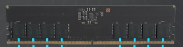
# Recap: DRAM vs SSD
DRAM - main memory:
- 2D arrays
- **temporarily** stores 1 bit per memory cell (capacitor)
- composed of billions of tiny **capacitor memory cells**
- gigabytes of working memory
- temporary storage, data loss when turned off
- read/write speed ca **17 nanoseconds**, which is 3000 times faster than SSD speeds
- like supersonic jet vs a tortoise
- DRAM stick with 8 chips holds 16 gigabytes of data
> needs power to continuously store and refresh the data held in capacitors

SSD:
- 3D massive arrays
- composed of a trillion memory cells
- SSD sticks smaller than DRAM, but can hold so much more data (terabytes)
- terabytes of storage
- read/write speed ca **50 microseconds**
> **permanent storage**

Prefetching
- moving data from SSD to DRAM before its needed
# How CPU moves data from SSD to DRAM
- when plugged in, the DRAM is directly connected to the CPU via 2 x memory channels that run through the mother board 
- inside the CPU is the DRAM interface, a memory controller which manages and communicates with DRAM
- for DDR5, each memory channel is divided into 2 parts, `Channel A`, and `Channel B`
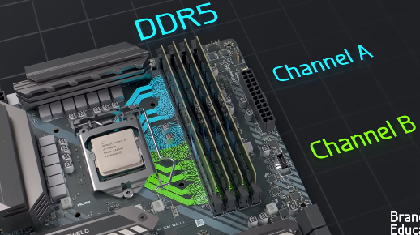
- these memory channels independently transfer 32 bits at a time using 32 data wires
- there are 21 additional wires, each memory channel carries an address specifying where to read or write data and
- using 7 control signals wires, to relay commands

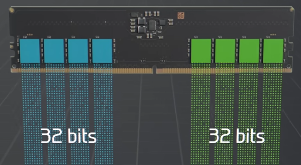
- the addresses and commands are sent to and shared by all 4 chips on the memory channel
- and those 4 chips work in parrallel
- the 32-bit data lines are divided among the chips and each chip only reads or write 8 bits at a time
- power is supplied by the motherboard (the slots we stick them into) and managed by these chips on the stick itself:

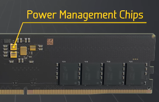
# Memory controller
- manages the flow of data from SSDs to DRAM
- and from DRAM to cache memory for processing by the cores
- more on cache memory in repo "computer-systems"

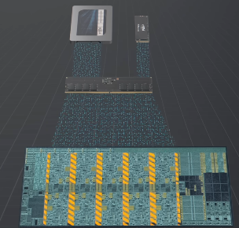
## Memory controller for DRAM
- sits inside the CPU
- manages the DRAM
- communicates with the DRAM

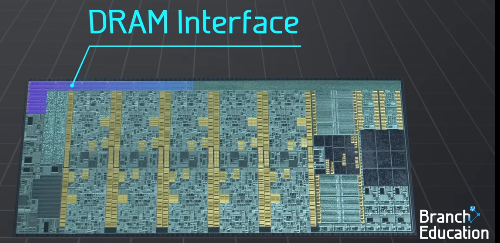

## Memory controller for M2 / SATA SSD 
- also sits inside the CPU
- manages and communicates with SSDs plugged into the M2 slot
- and also SSDs and hard drives plugged into SATA connectors

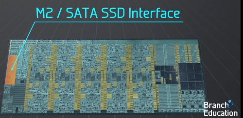

# How does a DRAM chip look like inside?
Opening up one of those 8 DRAM chips it'll look something like this
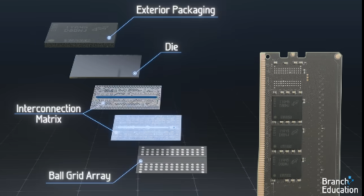

- interconnection layers and 
- an integrated circuit containing 32 banks (the die, also called `integrated circuit`)
- organised into 8 bank groups (in the case of a 2GB DRAM Die)
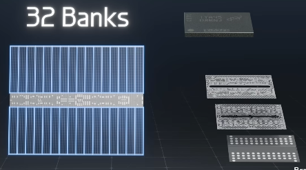

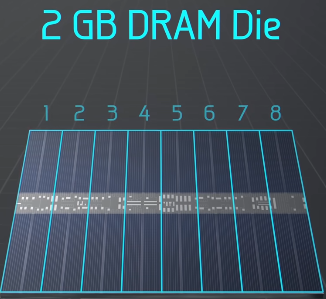

**within each each bank** 
- is a huge array, consisting of ca 65000 by 8000 memory cells
- basically rows and columns in a grid
- with a ton of circuitry around it
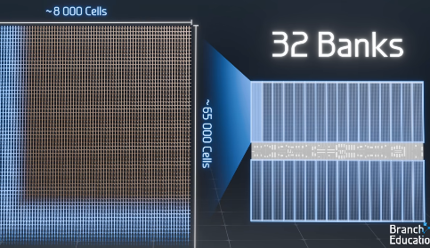

## overview of how it all works together

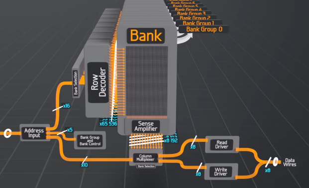

- to access 17 billion memory cells, it needs a 31-bit address:
	- 3 bits to select the appropriate bank group
	- 2 bits to select the bank
	- 16 bits to determine the exact row out of 65 000 (bank selector)
	- only 10 bits are needed for the column address, because chip **reads or writes 8 bits at a time**, the 8192 columns are grouped by 8 memory cells, all read or written to at a time ("by 8"), see sense amplifier/column multiplexer and read driver/write driver in the image above

- optimisation: this 31-bit address is separated into 2 parts and sent using only 21 wires:
	- first, the bank group, bank, and row address are sent 
	- then the column address
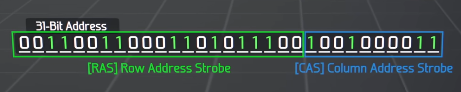
# how DRAM memory cells are organised - `1T1C` cell
`1T1C` means 1 transistor + 1 capacitor per bit
a few dozen nanometres in size
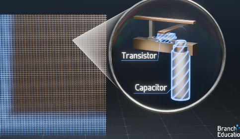

- 1 bit is stored as charge in each capacitor and the transistor is used to access that data
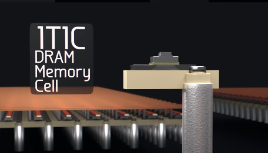

has 2 parts:
- capacitor (this one is a trench capacitor)
	- stores *one bit of data* in form of electrical charge
	- shaped like deep trench
	- dug into silicon, composed of 2 conductive surfaces, separated by a dielectric insulator which stops flow of electrons, but allows electric fields to pass through
	- if the capacitor is charged up with electrons to 1 Volt, it's a binary 1
	- if no charges are present, it's a binary 0
	- lots of different types of capacitors with different designs
		- MOS capacitor
		- Stacked capacitor
		- trench capacitor
		- substrate plate trench capacitor
		- 3D stacked capacitor etc

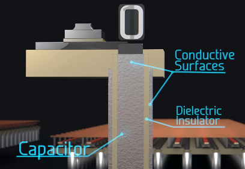

- transistor
	- to access and read or write data
	- the wordline wire (rows)
		- connects to the gate of the transistor
	- the bitline wire (columns)
		- connects to the other side of the transistor's channel
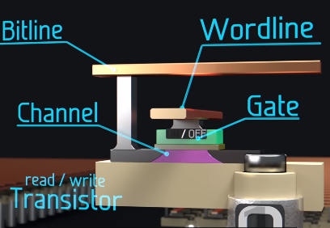

- applying voltage to the wordline 
	- turns on the transistor, electrons can flow through the channel and it connects the capacitor to the bitline
	- allowing us to access and charge up the capacitor to write a `1`
	- or discharge the capacitor to write a `0`

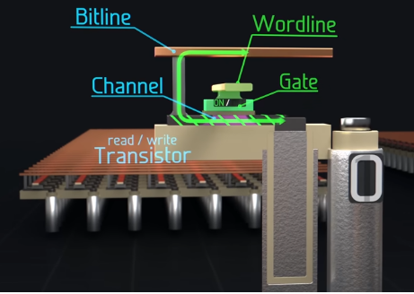

- and we can `read` the capacitor by measuring the amount of charge
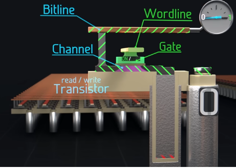

- but if wordline is off, then the transistor is off, and the capacitor is isolated from the bitline, 
	- then we are saving the data or charge that was previously written
- over time, electrons leak across the channel cause it's so small, and capacitor needs to be refreshed to recharge the leaked electrons
# How the array is organised
- each of the wordlines is connected in rows
- and the bitlines are connected incolumns
- they are both on different vertical layers, so they cross over each other but don't touch
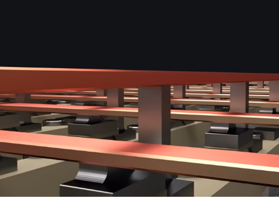

## wordlines and bitlines
- as we said the wordlines connect to each transistor's control gate in rows
- and then all the bitlines connect to the channel opposite each capacitor in columns
- when the wordline is active
	- all capacitors in only that row are connected to their bitlines
	- and hence activating all the memory cells in that row
	- only every one wordline is active at any given time
> So, the wordline turns the transistor on, and the transistor allows the bitline to charge the capacitor
  
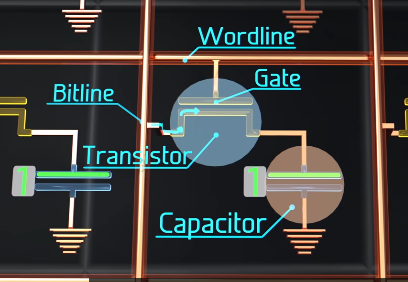

- again: when a wordline is on, all capacitors in that row are connected to respective bitlines
- activating all memory cells in that row

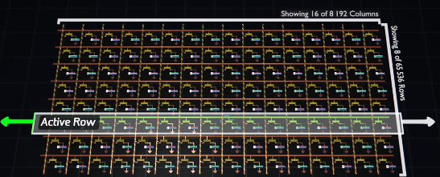

## row decoder and column multiplexer
The `Row Decoder` and `Column Multiplexer`
- is responsible for the `column selection`
- remember, the 31-bit address is used to activate **a group of just 8 memory cells**

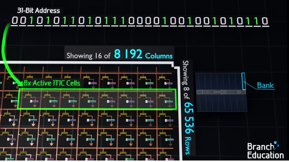

- from a 31-bit address, 
	- the first 5 bits are to select the bank
	- next 16 bits (`Row Selection`) are sent to `row decoder` 
		- to select just that one single wordline row (and turning on all transistors in that row and connecting all capacitors in that row to their bitlines)
	- remaining 10 bits of address (`Column Selection`) go to the `column multiplexer`
		- connects a **specific group of 8 bitlines** depending on that 10-bit address
		- to the 8 input and output wires at the bottom. 

### Row Decoder:
- select a single wordline

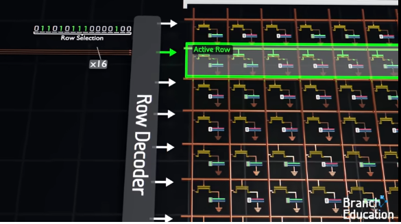

- all other 65000-ish wordlines are off:

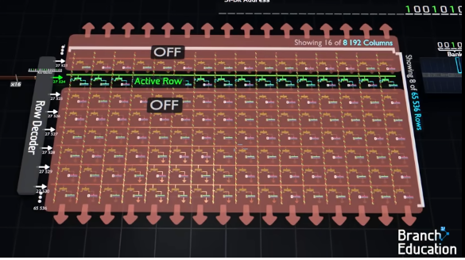

- logic diagram for a simple decoder:

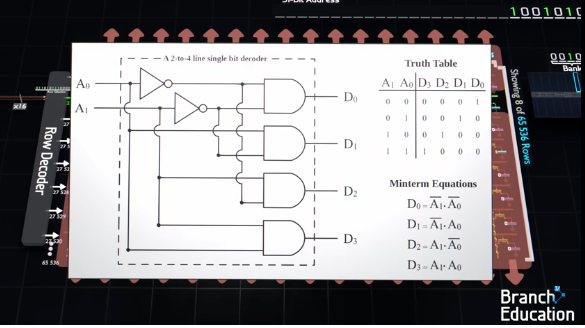
### Column Multiplexer:
- the column multiplexer takes the 9192 bitlines and depending on the 10-bits it uses from the address, 
- connects a specific group of 8 bitlines to the 8 input and output IO wires at the bottom

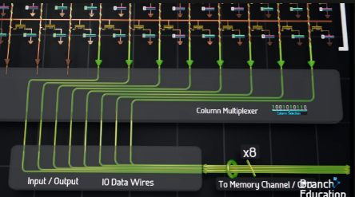

- the rest of the 8000-ish bitlines would be connected to nothing

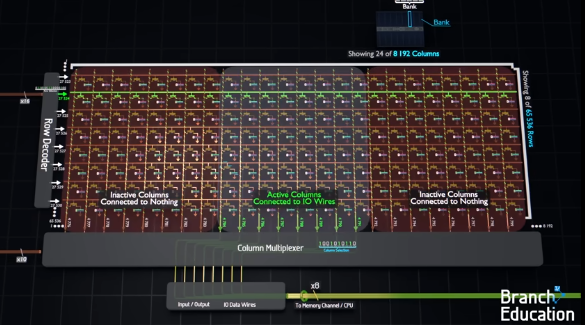

- logic diagram for a simple multiplexer:

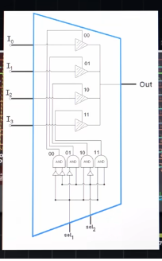

> now we can access any 8 bit active 1T1C cells in the big array
# How data is written/read from memory cells
- for this we need to add 2 elements to our layout:
	- `sense amplifier` at the bottom of each bitline
	- and `read/write driver` outside of the column multiplexer
## Sense amplifier

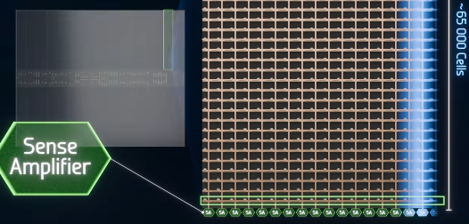

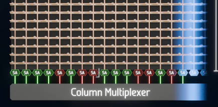

## Read Write Driver
- read write driver outside of the column multiplexer

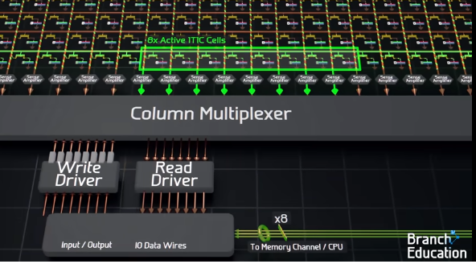

## overview of how it works
- the `sense amplifier`
	- measures the voltage in each capacitor, 
	- and then a set of 8 sense amplifiers is connected to either the read or write drivers
	- which relay data to and from the CPU
	- in total taking around 45 nanoseconds
	- bandwidth is around 48 Gigabytes per second which allows the OS to quickly context switch between processes
- downsides:
	- due to physical size of capacitor, the 1T1C array is confied to a 2D plane
		- resulting in lower bit density and higher cost per bit
	- also each capacitor quickly loses its charge, and every memory cell must be frequently refreshed (needs power); without power, DRAM would lose all its data in a tenth of a second

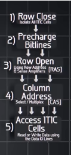
## reading from memory cells
So, if we read from a group of memory cells, then this happens:
- the read command and 31-bit address are sent from CPU to DRAM
- the first 5 bits select specific bank

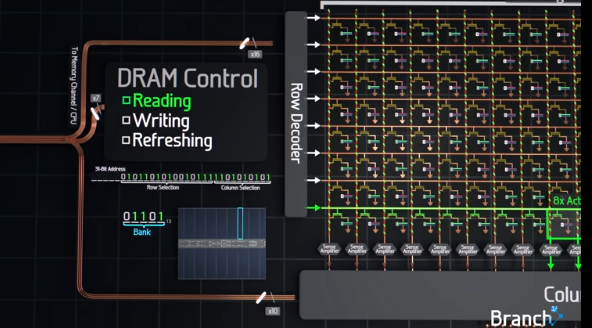

- the next step turns off all wordlines in that bank, thereby isolating all capacitors
	- then precharge all 8000 ish bitlines to 0.5 volts
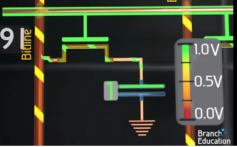
- next the 16-bit row address turns on a row 
	- and all capactors in that row are on and connected to their bitlines
- if an individual capacitor holds a `1` and is charged to `1 volt`, 
	- then some charge flows from that capacitor onto the 0.5 volt bitlines and the voltage on the bitline increases
	- the sense amplifier detects this slight change of voltage on the bitline, amplifies tha change and pushes the voltage on the bitline all the way up to 1 volt
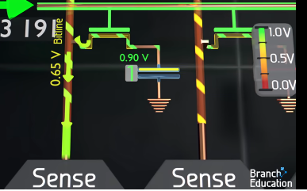   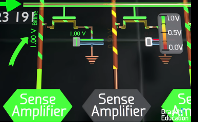   

- but if `0` is stored in the capacitor, 
	- charge flows from the bitline into the capactor, and the 0.5 volt bitline decreases in voltage
	- the sense amplifier detects this slight change of voltage on the bitline, amplifies it and drives the bitline voltage down to `0` volt or ground.
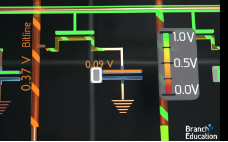    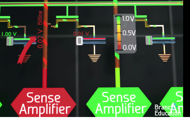

- now all 8000 ish bitlines are driven to `1V` or `0V` corresponding to the stored charge in the capacitors of the activated row
	- and this row is considered open
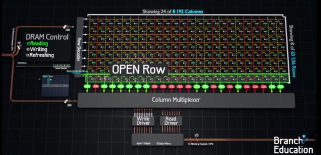

- next the `column select multiplexer` uses the 10-bit column address to connect the corresponding 8 bitlines to the read driver 
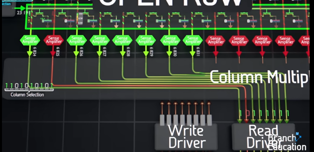

- which then sends these 8 values and voltages over the 8 data wires to the CPU
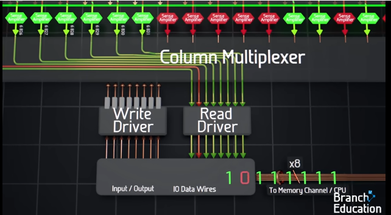

## writing to memory cells
- Initially things are the same as with read:
- the `write` command, address and 8 bits to be written are sent to the DRAM chip
- next, the bank is selected like above with the read action
- then the capacitors are isolated
- and the bitlines pre-charged to 0.5 V
- then using a 16-bit address, a single row is activated, the capacitors perturb the bitline and the sense amplifiers sense this and drive he bitlines to 1 or 0 thus opening the row
- next, the column address goes to the multiplexer
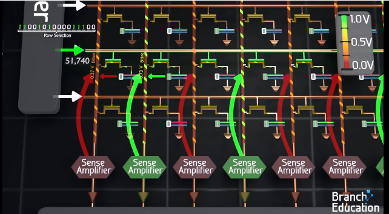

Now things are different:
- this time, because we write, the multiplexer conects to the specific 8 bilines to the `write driver`
	- which contains the 8 bits that the CPU had sent along the data wires and requested to write

- the write drivers are much stronger than the sense amplifiers 
	- so they override whatever voltage there was previously on teh bitline
	- and drive each of the 8 bitlines to 1 V (for a 1 to be written) or 0 V (for a 0)
	- this new bitline voltage **overrides** the previously stored charge in each of the 8 capacitors in the open row
> this is how we write 8 bits of data to the memory cells corresponding to the 31-bit address
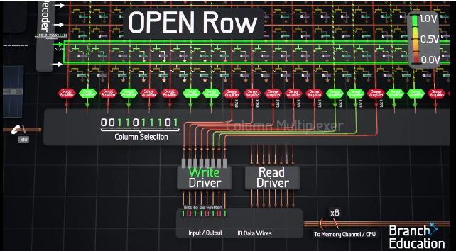

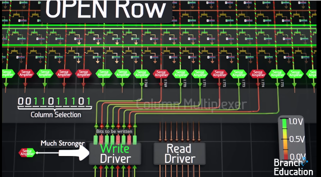
## Notes on read, write
- writing and reading happens concurrently with all the 4 chips in teh shared memory channel
	- using the same 31-bit address
	- and command wires
	- BUT with different data wires for each chip
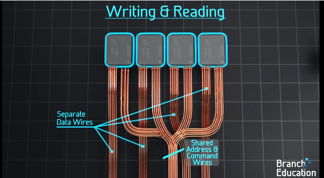

- Second, with DDR5 for a binary 1 
	- the voltage is actually 1.1 volts, for DDR4 it’s 1.2 volts,  and prior generations had even higher voltages,  
	- with the bitline precharge voltages being  half of these voltages.  
	- However, for DDR5,  when writing or refreshing a higher voltage,  around 1.4 volts is applied and stored in each capacitor for a binary 1 because charge leaks  out over time. However, for simplicity, we’re going to stick with 1 and 0.
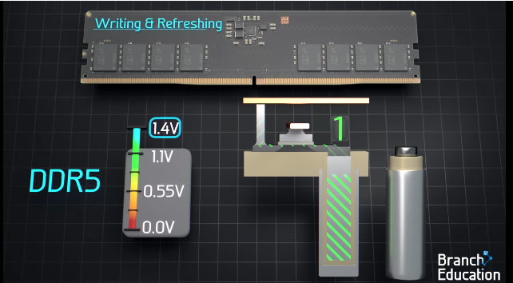

- Third, the number of bank groups, bankd, bitlines and wordlines varies between generations of chips, but is always in powers of 2.
## Refreshing Memory Cells
- transistors are very small and charges "leak" across the channel
- the refresh operation
	- close all rows
	- precharge the bitline to 0.5 V
	- open a row
	- to refresh capacitors perturb the bitlines as before with the read/write operations
	- and then the sense amplifiers drive the bitlines and capacitors of the open row full up to 1 V or down to 0 V depending on the stored value of the capacitor
> that's how refilling/refreshing works

- this process happens **row after row** taking 50 nanoseconds for each row
- for all 65000 ish rows it takes ca 3 milliseconds
- refresh occurs once every 64 milliseconds for each bank (because that's statistically below the worst case time it takes for a memory cell to leak too much)
# Optimisation
- Row Hits or page hit
	- skip all steps required to open a row and just use the 10-bit column address to multiplex a different set of 8 columns or bitlines, connecting them to the read or write driver; saves a lot of time
- Row Miss
	- when next address is for a different row; requires DRAM to close and isolate the currently open row, and then open a new row; takes time
	- Row hits are also the reason why the address is  sent in two sections, first the bank selection and row address called RAS and then the column address  called CAS. If the first part, the bank selection and row address, matches a currently open row,  then it’s a row hit, and all the DRAM needs is the column address and the new command, and then the  multiplexer simply moves around the open row.   
	- Because of the time saving in accessing an  open row, the CPU memory controller, programs, and compilers are optimized for increasing the  number of subsequent row hits. The opposite, called thrashing, is when a program jumps around  from one row to a different row over and over, and is obviously incredibly inefficient  both in terms of energy and time. 
- banks
	- 32 banks for the above reason: so each bank's rows, columns, sense amplifiers and row decoders can operate independently from each other
	- that way rows from different banks can be open at the same time, increasing chance of row hits
	- also helps to refresh one bank while the others are usable
- burst buffer
	- 128-bit read and write temporary storage location
	- right next to the multiplexer, so not 8 wires coming out of the multiplexer, but instead:
	- 128 wires that connect those buffer locations
	- the 10-bit column address is broken into two parts
		- 6 bits are used for the multiplexer
		- 4 bits are for the burst buffer
		- for very fast read/write
- folded DRAM layouts
- optimisations differ in different devices (or GPU DRAM called VRAM)
- DDR5 (different generations of DRAM)
- 
# How DRAM fits into the CPU pipeline
- Takes the _virtual address_ (`0x7FFF_FF00`),
    
- Checks the **TLB** for a cached mapping,
    
- If not found, walks the **page tables** (in RAM),
    
- Checks protection bits,
    
- Produces a **physical address** (e.g. `0x0023_FF00`),
    
- Sends that to the **memory controller**, which then activates the correct **DRAM row, bank, and column**.