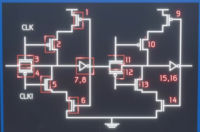
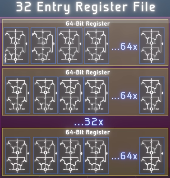
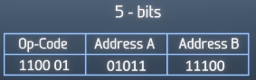
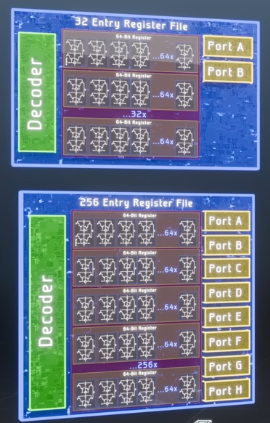
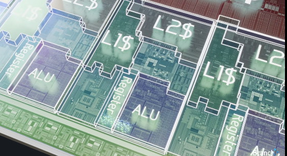
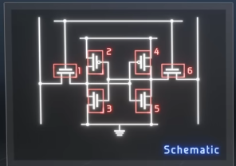

Source:
CoreDumped https://www.youtube.com/watch?v=rM9BjciBLmg  -> conceptual info via gated latches
Microchip Tech: https://www.youtube.com/watch?v=kU2SsUUsftA&t=16s   -> more realistic 6T cells

# Summary
**SRAM (Static RAM)** does _not_ use capacitors like DRAM.

- It stores each bit using a **flip-flop circuit** (typically **6 transistors per bit**, called a 6T cell)
- This is essentially a tiny **bistable latch** (two cross-coupled inverters)
- As long as power is supplied, the circuit **holds its state indefinitely** — no refresh needed

**Key contrast:**

- DRAM -> capacitor + periodic refresh (leaks charge)
- SRAM -> transistor latch -> stable while powered, no refresh

**Trade-offs:**

- SRAM: faster, lower latency, but **larger + more expensive**
- DRAM: slower, needs refresh, but **much denser + cheaper**

That’s why SRAM is used for **CPU caches**, DRAM for **main memory**.

# Details
https://www.youtube.com/watch?v=TfhL5kBiQVI Branch education
Cache Memory and Registers inside the CPU are made of transistors
incredibly fast access times and high bandwitdh

## registers - D-Flip-Flops
- registers store bits in D-Flip-Flops

- using 16 transistors per bit
- each register is ca 64 bits wide
- each processing core contains 32 registers, or entries, in a register file

Why are register files rather small?
- 32 registers are addressed using 5 bits within the instructions themselves
	- increasing number of registers would require longer instructions
	- that's why register files are rather small

- also bigger register files would need more wiring, a bigger decoder and more ports

- registers sit directly next to the execution units and the arithmetic logic unit
- and then spread across the table are the different cache levels and sizes

## Cache memory - SRAM
- cache memory uses 6 transistors per bit, assembled into SRAM cell

- multipy 6 transistors by 36 megabytes in the L3 cache, we get 1.8 billion transistors
- if we add the other 2 levels of caches plus the space for each address, it results in ca a third of the CPU's 26 billion transistors being dedicated to cache.
- very expensive, hence cache is so small